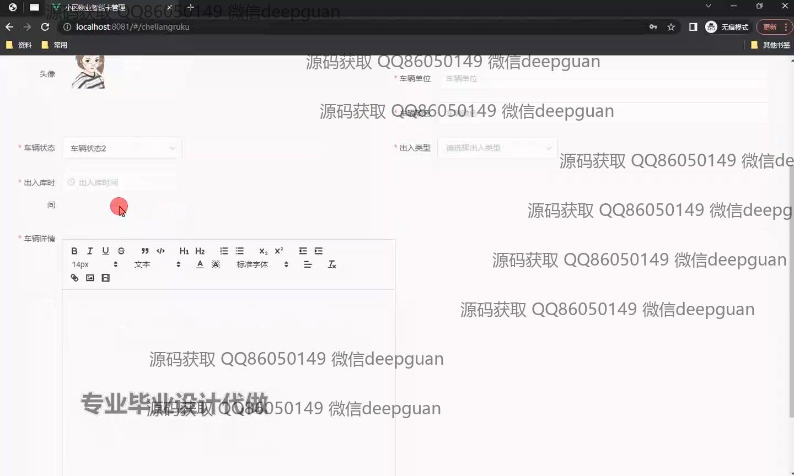

<h1 align="center">基于Java的小区物业智能卡管理的设计与实现</h1>

## 简介
小区物业智能卡管理系统：包括停车登记管理、费用信息管理、留言板管理、公告信息管理、业主服务管理等功能模块，提升社区智能化管理水平，提高物业管理效率。    --计算机毕业设计源码；毕设源码；java毕业设计源码

## 联系方式

<h3 align="center">获取完整代码与数据库文件 + 微信：deepguan QQ: 86050149 QQ群: 783742310</h3>

<h3 align="center">可帮忙远程部署 包运行成功！提供远程部署、修改代码、设计文档指导、代码讲解等服务！</h3>

## 功能介绍（完整见运行截图）
管理员：登录注册退出，管理小区物业智能卡系统，功能模块包括停车登记管理、费用信息管理、公告管理等。通过系统，可处理车辆入库信息，审核和发布公告，管理留言信息，查看和搜集住户缴费记录。用户还可以利用业主服务管理模块，查看提交的服务请求并进行相应处理。

业主：通过登录系统访问个人中心，进行停车位管理及费用缴纳，查看车辆进出记录及服务状态。系统提供停车登记管理功能，业主可查询并记录车辆信息，使用模糊查询功能查看费用详单，进行缴费管理。业主还能通过留言板管理模块与物业进行有效沟通，并查看公告信息。

物业人员：能够访问和管理所有模块，查看停车位及业主费用信息，并能通过公告管理模块发布和编辑重要信息。物业人员还可通过留言板与业主互动，处理服务请求，通过车辆入库管理功能，记录及审查车辆出入库数据，保障小区的安全与管理智能化。

访客：在系统中暂无具体操作角色功能，与其他角色互动较少。

## 运行截图

本代码来源于网络,仅供学习参考使用!

